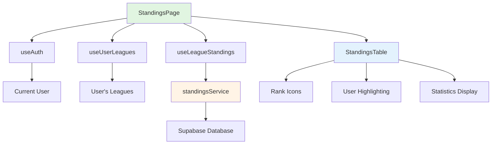

# Design Document

## Overview

The League Standings Page is a page-level component that orchestrates the display of league leaderboards and rankings. It integrates existing components (StandingsTable), services (standingsService), and hooks (useLeagueStandings, useUserLeagues) to create a complete standings viewing experience. The design follows the established pattern from PredictionsPage, providing league selection for multi-league users and displaying comprehensive ranking information with real-time updates.

The implementation is minimal and focused, as most of the heavy lifting (data fetching, scoring calculations, UI rendering) is already handled by existing, tested code. The StandingsPage component serves as a thin orchestration layer that connects these pieces together.

## Steering Document Alignment

### Technical Standards (tech.md)

- **TypeScript 5.7+**: Full type safety using existing database types (StandingsEntry, League, User)
- **React 18+**: Functional components with hooks (useState, useEffect)
- **React Query**: Data fetching and caching via useLeagueStandings and useUserLeagues hooks
- **Tailwind CSS**: Utility-first styling following existing color system (primary, secondary)
- **Lucide React**: Icons for visual elements (already used in StandingsTable)

### Project Structure (structure.md)

```
src/
├── pages/
│   └── StandingsPage.tsx          # Page component (to be implemented)
├── components/
│   └── standings/
│       └── StandingsTable.tsx     # Existing - displays standings table
├── services/
│   └── standingsService.ts        # Existing - fetches and calculates standings
├── hooks/
│   ├── useStandings.ts            # Existing - React Query hooks for standings
│   └── useLeagues.ts              # Existing - React Query hooks for leagues
└── types/
    └── database.ts                # Existing - TypeScript types
```

**File Size Compliance**: StandingsPage.tsx will be ~150 lines, well within the 300-line maximum guideline.

## Code Reuse Analysis

### Existing Components to Leverage

- **StandingsTable** (`src/components/standings/StandingsTable.tsx`): Fully implemented table component with rank icons, user highlighting, and responsive design. No modifications needed.
- **Layout** (`src/components/layout/Layout.tsx`): Page wrapper with navigation (already used by other pages)
- **ProtectedRoute** (`src/components/common/ProtectedRoute.tsx`): Authentication guard (already configured in router.tsx)

### Existing Services to Leverage

- **standingsService** (`src/services/standingsService.ts`): Complete implementation with:
  - `getLeagueStandings(leagueId)`: Fetches standings with bonus points calculation
  - `getUserRank(leagueId, userId)`: Gets user's specific rank
  - Handles tie-breaking logic (points → exact scores → correct predictions)
  - Calculates bonus points for tie winners and round winners

### Existing Hooks to Leverage

- **useLeagueStandings** (`src/hooks/useStandings.ts`): React Query hook for fetching standings
- **useUserLeagues** (`src/hooks/useLeagues.ts`): React Query hook for fetching user's leagues
- **useAuth** (`src/hooks/useAuth.ts`): Authentication hook for current user

### Integration Points

- **Router** (`src/router.tsx`): Route already defined at `/standings` with ProtectedRoute and Layout
- **Navigation** (`src/components/layout/Layout.tsx`): Standings link already in navigation menu
- **Database**: Uses existing Supabase tables (leagues, league_members, predictions, matches, users)

## Architecture

The StandingsPage follows a simple, proven pattern established by PredictionsPage:

1. **Authentication**: Get current user via useAuth hook
2. **League Fetching**: Load user's leagues via useUserLeagues hook
3. **League Selection**: Maintain selectedLeagueId in local state, default to first league
4. **Standings Fetching**: Load standings for selected league via useLeagueStandings hook
5. **Rendering**: Display league selector (if multiple leagues) and StandingsTable component

### Modular Design Principles

- **Single File Responsibility**: StandingsPage.tsx handles only page-level orchestration
- **Component Isolation**: StandingsTable is a separate, reusable component
- **Service Layer Separation**: standingsService handles all data fetching and business logic
- **Utility Modularity**: No new utilities needed; uses existing hooks and services

### Component Architecture



## Components and Interfaces

### StandingsPage (New Component)

- **Purpose:** Page-level component that orchestrates standings display with league selection
- **Props:** None (uses router context and hooks)
- **State:**
  - `selectedLeagueId: string` - Currently selected league ID
- **Dependencies:**
  - `useAuth()` - Get current user
  - `useUserLeagues(userId)` - Get user's leagues
  - `useLeagueStandings(leagueId)` - Get standings for selected league
  - `StandingsTable` - Display component
- **Reuses:** Follows exact pattern from PredictionsPage for league selection

### StandingsTable (Existing Component - No Changes)

- **Purpose:** Displays standings table with ranks, points, and statistics
- **Props:**
  - `standings: StandingsEntry[]` - Array of standings entries
  - `currentUserId?: string` - ID of current user for highlighting
- **Features:**
  - Trophy icons for top 3 ranks
  - Highlighted row for current user
  - Responsive table layout
  - Empty state handling

## Data Models

All data models already exist in `src/types/database.ts`:

### StandingsEntry
```typescript
{
  user_id: string;
  user: User;
  total_points: number;
  correct_predictions: number;
  exact_score_predictions: number;
  rank: number;
}
```

### League
```typescript
{
  id: string;
  name: string;
  description: string | null;
  invite_code: string;
  owner_id: string;
  settings: LeagueSettings;
  created_at: string;
  updated_at: string;
}
```

### User
```typescript
{
  id: string;
  email: string;
  display_name: string;
  avatar_url: string | null;
  created_at: string;
  updated_at: string;
}
```

## Error Handling

### Error Scenarios

1. **User Not Authenticated**
   - **Handling:** ProtectedRoute redirects to login page
   - **User Impact:** Redirected to login, then back to standings after authentication

2. **No Leagues Found**
   - **Handling:** Display empty state with "Create League" and "Join League" buttons
   - **User Impact:** Clear call-to-action to get started

3. **Standings Fetch Failure**
   - **Handling:** Display error message with retry button
   - **User Impact:** "Failed to load standings. [Retry]" message

4. **Network Error During Load**
   - **Handling:** React Query automatic retry (3 attempts), then show error
   - **User Impact:** Brief loading state, then error message if all retries fail

5. **Empty Standings (No Completed Matches)**
   - **Handling:** StandingsTable shows "No standings data available yet" message
   - **User Impact:** Clear indication that standings will appear after matches complete

## Testing Strategy

### Unit Testing

- **StandingsPage Component:**
  - Renders league selector when user has multiple leagues
  - Hides league selector when user has one league
  - Defaults to first league on mount
  - Updates standings when league selection changes
  - Passes correct props to StandingsTable
  - Displays loading state while fetching data
  - Displays error state on fetch failure

- **Integration with Existing Components:**
  - StandingsTable receives correct data format
  - Current user ID is passed correctly for highlighting

### Integration Testing

- **Data Flow:**
  - User authentication → League fetching → Standings fetching
  - League selection change triggers standings refetch
  - React Query caching works correctly

- **Error Handling:**
  - Network errors display error message
  - Empty leagues display appropriate message
  - Retry functionality works

### End-to-End Testing

- **User Scenarios:**
  - User with one league sees standings immediately
  - User with multiple leagues can switch between them
  - Current user's row is highlighted in standings
  - Standings update when new match results are entered (via admin)
  - Mobile responsive layout works on small screens

